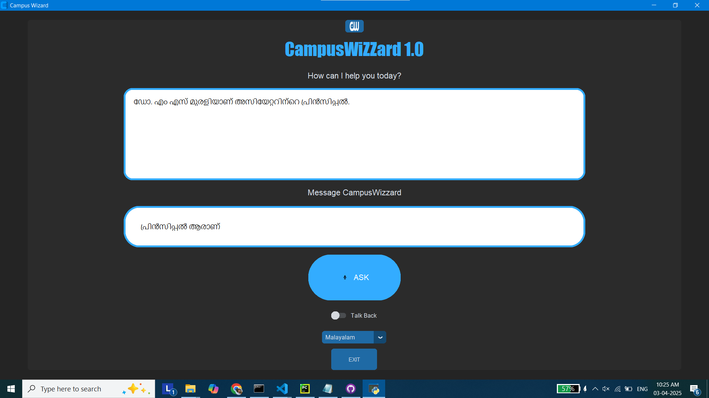

# Campus Wizard - AI-Powered Receptionist

## 📌 Project Overview
Campus Wizard is an AI-powered virtual receptionist designed as Main Project by Amal Mathew , Arsha S and Harikrishnan H (21-25 CSEA ASIET) to assist users with campus-related queries. The system leverages **speech recognition, AI chat models, and text-to-speech synthesis** to provide seamless and interactive responses.

## 🛠 Features
- 🎤 **Voice Input:** Uses speech recognition to capture user queries.
- 🤖 **AI-Powered Responses:** Utilizes a custom Llama3-based **Ollama** model for processing.
- 🌍 **Multilingual Support:** Supports translation with **GoogleTranslator**.
- 🔊 **Text-to-Speech:** Converts responses to speech using **gTTS**.
- 🖥 **CustomTkinter UI:** User-friendly and modern GUI.
- 🏫 **Campus-Specific Knowledge:** Provides precise and relevant answers about the campus.

## 🚀 Technologies Used
- **Python** (Core Development)
- **Ollama** (AI Model)
- **SpeechRecognition** (Speech Input)
- **gTTS** (Text-to-Speech Conversion)
- **Deep-Translator** (Language Translation)
- **CustomTkinter** (Graphical Interface)
- **Pillow** (Image Processing)

## 📦 Installation
Ensure you have Python installed (3.8+ recommended). Then, install dependencies using:
```sh
pip install -r requirements.txt
```

## ▶️ Usage
1. Run the application:
   ```sh
   python main.py
   ```
2. Click the **ASK** button to start speaking.
3. The AI processes your query and responds accordingly.
4. Enable "Talk Back" to hear the response.

## 📷 UI Preview



## 📖 Configuration
### Modify Language Support
To change the default response language, update:
```python
selected_language = "en"  # Change to "ml" for Malayalam, etc.
```

## 🛠 Troubleshooting
- **Microphone not detected?** Ensure your microphone is properly configured in system settings.
- **No response from AI?** Check the Ollama model installation and ensure it's running correctly.

## 🤝 Contributing
1. Fork the repository.
2. Create a feature branch: `git checkout -b feature-name`
3. Commit changes: `git commit -m "Add new feature"`
4. Push to branch: `git push origin feature-name`
5. Submit a pull request.

## 📜 License
This project is licensed under the **MIT License**.

## 💡 Future Improvements
- Enhance **natural language understanding** for more complex queries.
- Support for **more languages**.
- Improve UI responsiveness and aesthetics.

## 🌟 Show Your Support
If you like this project, **star the repo** ⭐ and contribute! 🚀

